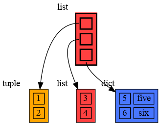
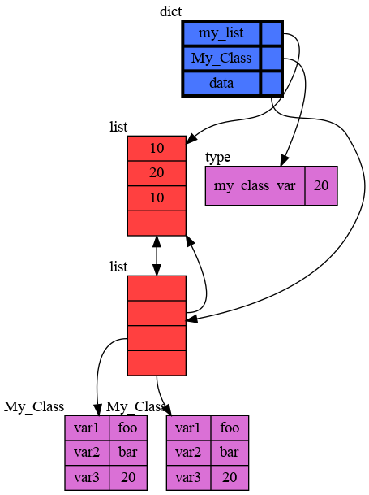

# Graph your Memory #

Want to draw a graph of your data in Python to better understand its
structure or the Python memory model in general?

Just call "memory_graph.show(your_data)", an example:

```
import memory_graph

data = [ (1, 2), [3, 4], {5:'five', 6:'six'} ]
memory_graph.show( data )
```

This shows the graph with the starting point of your 'data' drawn using thick
lines, the program blocks until the <ENTER> key is pressed.



If `show()` doesn't work well on your system (the PDF viewer integration
is platform specific) use `render()` to output the graph in the format
of your choosing. Use `block=False` to turn off blocking.

```
memory_graph.render( data, "my_graph.png", block=False)
```

### Larger Example ###

This larger example shows objects that share a class (static) variable and
also shows a recursive reference.

```
import memory_graph

my_list = [10, 20, 30]

class My_Class:
    my_class_var = 1000 # class variable: shared by different objects
    
    def __init__(self):
        self.var1 = "foo"
        self.var2 = "bar"

obj1 = My_Class()
obj2 = My_Class()

data=[my_list, my_list, obj1, obj2]

my_list.append(data) # recursive reference

memory_graph.show( data )
```


### Install ###

Install using pip:

```
pip install memory_graph
```

### Author ###
Bas Terwijn

### Inspiration ###
Inspired by [PythonTutor](https://pythontutor.com/visualize.html).
